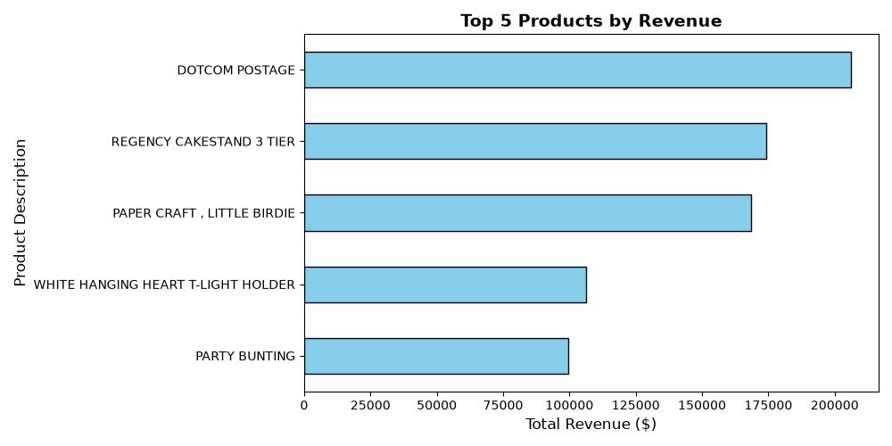
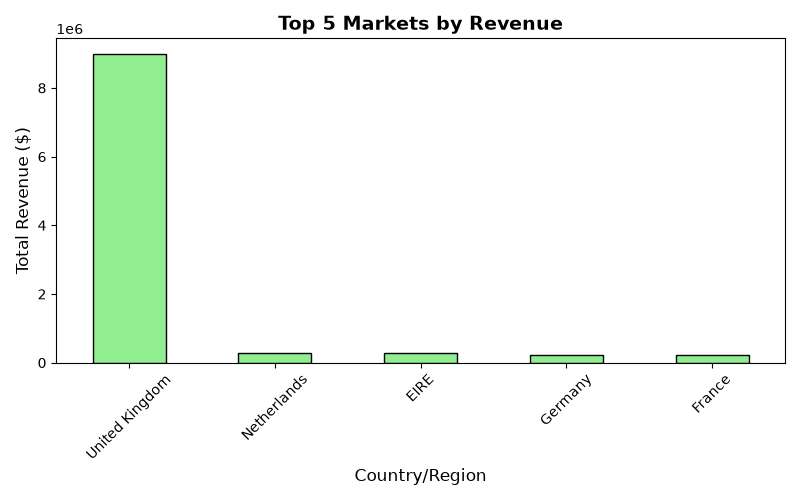

# E-Commerce Data Integrity & Sales Performance Analysis

## 📌 Project Overview
An end-to-end data cleaning and exploratory data analysis (EDA) project using a retail transaction dataset (536k+ records). The primary goal was to address critical data anomalies—such as duplicate entries, unassigned identifiers, and negative financial metrics—to establish a clean baseline for reliable business intelligence reporting.

## 🛠️ Data Quality Framework & Strategy
Instead of destructively deleting records, a robust data auditing strategy was implemented:
* **Duplicate Rows:** Evaluated and purged completely identical entries to prevent artificial inflation of metrics.
* **Missing Attributes:** Handled thousands of null descriptions by mapping them to `'Unknown Product'`. Over 100,000 unassigned `CustomerID` fields were safely assigned a proxy token (`99999`) to preserve essential geographic and baseline revenue data.
* **Financial Anomalies:** * Isolated **Negative Quantities** into `df_returns` to track operational product return patterns without polluting forward sales numbers.
  * Extracted **Zero Unit Prices** into `df_promotions` to evaluate marketing giveaway metrics.
  * Filtered out extreme system exceptions to build a finalized `df_sales` model containing 524,878 clean operational records.

## 📊 Business Insights

### 1. Revenue Baseline
* **Total Clean Revenue:** $[Insert Your Total Revenue Here]

### 2. Top Performing Products
Below are the top 5 revenue-generating items in the system:

### 3. Geographic Performance
The top 5 market segments driving the majority of transactional revenue:

## 🧰 Tech Stack
* **Language:** Python
* **Libraries:** Pandas, NumPy, Matplotlib
